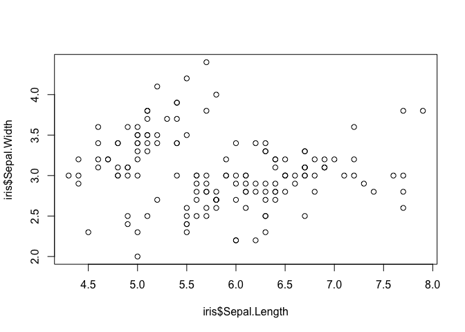
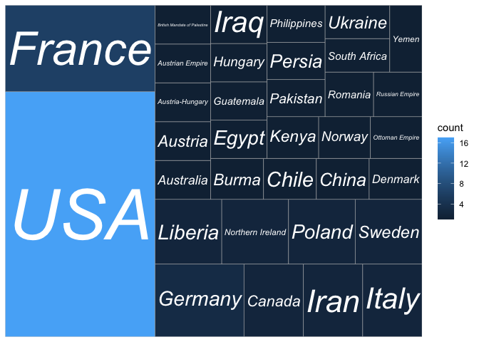
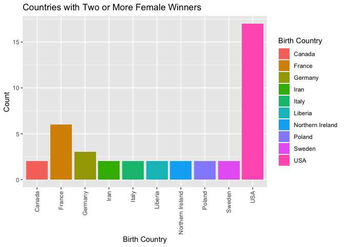
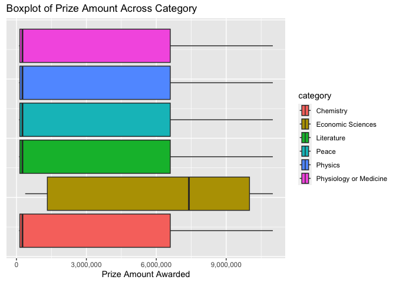
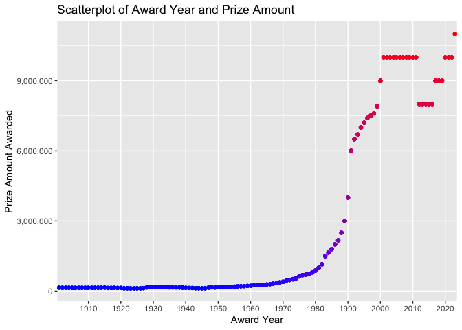

Project 2
================
Tiffany Craft
2023-10-07

- [Required Packages](#required-packages)
- [Functions to Contact API](#functions-to-contact-api)
- [Exploratory Data Analysis (EDA)](#exploratory-data-analysis-eda)
- [Reflection](#reflection)

# Required Packages

`httr` `jsonline` `tidyverse` `scales` treemapify ggfittext

``` r
library(httr)
library(jsonlite)
library(tidyverse)
library(scales)
library(treemapify)
library(ggfittext)
```

# Functions to Contact API

``` r
getEnglish <- function(df, column){
  df %>% unnest_wider(column, names_repair = "unique_quiet") %>%
    subset(select = -c(no, se)) %>%
    rename(!!sym(column) := en)
}
```

``` r
prizes <- function(awardCategory = "all", year = "all"){
  ###
  # This functions returns a data.frame with metadata on NHL teams. It can also
  # return those columns for a single team if a franchise ID or name is passed.
  ###
  
  # Get the observation data for the United States from the region endpoint.
  outputAPI <- fromJSON(
      "https://api.nobelprize.org/2.1/nobelPrizes?limit=1000&sort=asc"
      )
  
  # Select only the data.frame from the JSON output.
  output <- outputAPI$nobelPrizes %>%
    getEnglish("category") %>%
    getEnglish("categoryFullName")
  
  # If team does not equal "all", check if it is a franchise ID or team name.
  if (awardCategory != "all"){
    
    # If team is in the id column, subset output for just that row.
    if (awardCategory %in% output$category){
      output <- output %>%
        filter(category == awardCategory) %>%
        select(awardYear, category, categoryFullName, dateAwarded, prizeAmount, laureates)
        
    }
    # Otherwise, throw an informative error.
    else {
      message <- paste("ERROR: Argument for category was not found in the",
                       "award category column. Try category('all') to",
                       "find the category you're looking for.")
      stop(message)
    }
  }
  # Do nothing if the fish value equals "all".
  else {
    output <- output %>%
      select(awardYear, category, categoryFullName, dateAwarded, prizeAmount, laureates)
  }
  
  # If team does not equal "all", check if it is a franchise ID or team name.
  if (year != "all"){
    
    # If team is in the id column, subset output for just that row.
    if (year %in% output$awardYear){
      output <- output %>%
        filter(awardYear == year) %>%
        select(awardYear, category, categoryFullName, dateAwarded, prizeAmount, laureates)
        
    }
    # Otherwise, throw an informative error.
    else {
      message <- paste("ERROR: Argument for year was not found in the",
                       "award year column. Try year('all') to",
                       "find the year you're looking for.")
      stop(message)
    }
  }
  # Do nothing if the fish value equals "all".
  else {
    output <- output %>%
      select(awardYear, category, categoryFullName, dateAwarded, prizeAmount, laureates)
  }
  
  # Return the output data.frame.
  return(output)
}
```

``` r
laureates <- function(country = "all", laureateGender = "both"){
  ###
  # This functions returns a data.frame with metadata on NHL teams. It can also
  # return those columns for a single team if a franchise ID or name is passed.
  ###
  
  # Get the observation data for the United States from the region endpoint.
  outputAPI <- fromJSON(
      "http://api.nobelprize.org/2.1/laureates?limit=1000"
      )
  
  # Select only the data.frame from the JSON output.
  output <- outputAPI$laureates %>%
    unnest_wider(nobelPrizes, names_repair = "unique_quiet") %>%
    getEnglish("category") %>%
    unnest_wider(birth) %>%
    unnest_wider(place) %>%
    getEnglish("city") %>%
      rename("birthCity" = "city") %>%
    getEnglish("country") %>%
      rename("birthCountry" = "country") %>%
    getEnglish("cityNow") %>%
    getEnglish("countryNow") %>%
    getEnglish("continent") %>%
    getEnglish("locationString") %>%
    getEnglish("fullName") %>%
    mutate(awardYear = sapply(awardYear, toString)) %>%
    mutate(category = sapply(category, toString))

  # If team does not equal "all", check if it is a franchise ID or team name.
  if (country != "all"){
    
    # If team is in the id column, subset output for just that row.
    if (country %in% output$birthCountry){
      output <- output %>%
        filter(birthCountry == country) %>%
        select(id, fullName, gender, awardYear, category, birthCity, birthCountry,
               cityNow, countryNow, continent,locationString)
    }
    # If team is in the fullName column, subset output for just that row.
    else if (country %in% output$countryNow){
      output <- output %>%
        filter(countryNow == country) %>%
        select(id, fullName, gender, awardYear, category, birthCity, birthCountry,
               cityNow, countryNow, continent,locationString)
    }
    # Otherwise, throw an informative error.
    else {
      message <- paste("ERROR: Argument for country was not found in either",
                       "the birth country or country now columns. Try country('all') to",
                       "find the country you're looking for.")
      stop(message)
    }
  }
  # Do nothing if the fish value equals "all".
  else {
      output <- output %>%
        select(id, fullName, gender, awardYear, category, birthCity, birthCountry,
               cityNow, countryNow, continent,locationString)
  }
  
  # If team does not equal "all", check if it is a franchise ID or team name.
  if (laureateGender != "both"){
    
    # If team is in the id column, subset output for just that row.
    if (laureateGender %in% output$gender){
      output <- output %>%
        filter(gender == laureateGender) %>%
        select(id, fullName, gender, awardYear, category, birthCity, birthCountry,
               cityNow, countryNow, continent,locationString)
    }
    # Otherwise, throw an informative error.
    else {
      message <- paste("ERROR: Argument for laureate's gender was not found in the",
                       "gender column. Try genders('both') to",
                       "find the gender you're looking for.")
      stop(message)
    }
  }
  # Do nothing if the fish value equals "all".
  else {
      output <- output %>%
        select(id, fullName, gender, awardYear, category, birthCity, birthCountry,
               cityNow, countryNow, continent,locationString)
  }
  
  # Return the output data.frame.
  return(output)
}
```

# Exploratory Data Analysis (EDA)

To begin my data analysis, I wanted to investigate the following
question: How does the number of Nobel Prize winners differ between male
and female laureates? For example, has that changed throughout the
years? Are there noticeable differences between categories? Is there a
relationship between the gender of laureates and the countries they are
from?

I started by pulling the data on all the winning laureates using my
laureates() function and then created a one-way contingency table to
compare the total winners based on gender.

``` r
winners <- laureates()
table(winners$gender)
```

    ## 
    ## female   male 
    ##     64    901

As I expected, there have been significantly more male Nobel Prize
winners than female winners. To continue my investigation, I decided to
create a new, two-way contingency table using the same data to see
whether there might be a relationship between winner’s gender and their
country of birth based on the assumption that women may receive more
opportunities that could lead to their winning a nobel prize if they
grow up in certain countries.

``` r
table(winners$gender, winners$birthCountry)
```

    ##         
    ##          Argentina Australia Austria Austria-Hungary Austrian Empire Bavaria
    ##   female         0         1       1               1               1       0
    ##   male           4         9      15              12               3       1
    ##         
    ##          Belgian Congo Belgium Bosnia Brazil British India
    ##   female             0       0      0      0             0
    ##   male               1       9      1      1             2
    ##         
    ##          British Mandate of Palestine British Protectorate of Palestine
    ##   female                            1                                 0
    ##   male                              4                                 1
    ##         
    ##          British West Indies Bulgaria Burma Canada Chile China Colombia Costa Rica
    ##   female                   0        0     1      2     1     1        0          0
    ##   male                     1        1     0     19     1    10        2          1
    ##         
    ##          Crete Cyprus Czechoslovakia Denmark East Friesland East Timor Egypt Ethiopia
    ##   female     0      0              0       1              0          0     1        0
    ##   male       1      1              1      11              1          2     5        1
    ##         
    ##          Faroe Islands (Denmark) Finland France Free City of Danzig French Algeria
    ##   female                       0       0      6                   0              0
    ##   male                         1       2     52                   1              2
    ##         
    ##          French protectorate of Tunisia German-occupied Poland Germany Gold Coast
    ##   female                              0                      0       3          0
    ##   male                                1                      1      77          1
    ##         
    ##          Guadeloupe Island Guatemala Hesse-Kassel Hungary Iceland India Iran Iraq
    ##   female                 0         1            0       1       0     0    2    1
    ##   male                   1         1            1       8       1    10    0    0
    ##         
    ##          Ireland Italy Japan Java, Dutch East Indies Kenya Korea Lebanon Liberia
    ##   female       0     2     0                       0     1     0       0       2
    ##   male         5    16    28                       1     0     2       1       0
    ##         
    ##          Lithuania Luxembourg Madagascar Mecklenburg Mexico Morocco New Zealand
    ##   female         0          0          0           0      0       0           0
    ##   male           1          2          1           1      3       1           3
    ##         
    ##          Nigeria Northern Ireland Norway Ottoman Empire Pakistan Persia Peru
    ##   female       0                2      1              1        1      1    0
    ##   male         1                3     12              1        0      0    1
    ##         
    ##          Philippines Poland Portugal Prussia Romania Russia Russian Empire Saint Lucia
    ##   female           1      2        0       0       1      0              1           0
    ##   male             0      7        2      13       3     18             15           1
    ##         
    ##          Schleswig Scotland South Africa Southern Rhodesia Spain Sweden Switzerland
    ##   female         0        0            1                 0     0      2           0
    ##   male           2       11            8                 1     7     28          19
    ##         
    ##          Taiwan the Netherlands Tibet Trinidad and Tobago Turkey Tuscany Ukraine
    ##   female      0               0     0                   0      0       0       1
    ##   male        1              19     1                   1      2       1       0
    ##         
    ##          United Kingdom USA USSR Venezuela Vietnam West Germany Württemberg Yemen
    ##   female              0  17    0         0       0            0           0     1
    ##   male               89 272    7         1       1            5           1     0

The table shows some interesting information, including which countries
have had the most Nobel Prize winners. Unsurprisingly, the United States
has not only the most total winners but also the most female winners.
Some interesting observations are that many countries that have a lot of
total winners, such as Japan and the United Kingdom, actually have no
female winners. Whereas, others countries, such as Iran and Iraq, have
only had female Nobel Prize winners.

Since the contingency table comparing gender and birth country is rather
large, I decided to narrow in on only the countries that have female
winners. I pulled some new data on all the winning female laureates
using my laureates() function with the gender input set to “female.” I
then created a bar graph to plot the number of female Nobel Prize
winners group based on country.

``` r
femaleWinners <- laureates(laureateGender = "female")
femaleByCountry <- femaleWinners %>%
  group_by(birthCountry) %>%
  summarise(count = n())
plot1 <- ggplot(femaleByCountry, aes(x = birthCountry, y =count)) + 
  geom_bar(aes(fill = birthCountry), stat = "identity") +
  #adding labels and title
  labs(x = "Birth Country", y = "Count", title ="Female Nobel Prize Winners by Country") +
  scale_fill_discrete(name = "Birth Country") +
  theme(axis.text.x = element_text(angle = 90, vjust = 0.5, hjust=1))
plot1
```

<!-- -->

This looks better, but it is a bit difficult to read because of the
number of countries included. I decided to try plotting the same data in
a different format using the treemaps package for ggplot.

``` r
plot2 <- ggplot(femaleByCountry, aes(area = count, fill = count, label = birthCountry)) +
  geom_treemap() +
  geom_treemap_text(fontface = "italic", colour = "white", place = "centre", grow = TRUE)
plot2
```

<!-- -->

The treemap is nice because it helps to really highlight which countries
have the most female Nobel Prize Winners based on the size of their
individual tiles.

Still, since we could see from the bar graph that there are clearly a
lot of countries that have just one female Nobel Prize Winner, I thought
we could further narrow down the countries with more female winners by
sorting the data for only those that have two or more female winners.

``` r
twoPlusFemales <- femaleByCountry %>%
  filter(count > 1)
plot3 <- ggplot(twoPlusFemales, aes(x = birthCountry, y =count)) + 
  geom_bar(aes(fill = birthCountry), stat = "identity") +
  #adding labels and title
  labs(x = "Birth Country", y = "Count", title ="Countries with Two or More Female Winners") +
  scale_fill_discrete(name = "Birth Country") +
  theme(axis.text.x = element_text(angle = 90, vjust = 0.5, hjust=1))
plot3
```

<!-- -->

Based on this new graph, we can see that the majority of countries with
two or more female Nobel Prize winners are located in either Europe or
North America, with the exception of Iran and Liberia.

This brings me to back to my earlier observation that Iran and Iraq had
only female Nobel Prize winners but no male winners. To further
investigate this information, I used my laureates() function to pull
data for these countries only.

``` r
laureates("Iran")
```

    ## # A tibble: 2 × 11
    ##   id    fullName    gender awardYear category birthCity birthCountry cityNow countryNow
    ##   <chr> <chr>       <chr>  <chr>     <chr>    <chr>     <chr>        <chr>   <chr>     
    ## 1 1033  Narges Moh… female 2023      Peace    Zanjan    Iran         Zanjan  Iran      
    ## 2 773   Shirin Eba… female 2003      Peace    Hamadan   Iran         Hamadan Iran      
    ## # ℹ 2 more variables: continent <chr>, locationString <chr>

``` r
laureates("Iraq")
```

    ## # A tibble: 1 × 11
    ##   id    fullName    gender awardYear category birthCity birthCountry cityNow countryNow
    ##   <chr> <chr>       <chr>  <chr>     <chr>    <chr>     <chr>        <chr>   <chr>     
    ## 1 967   Nadia Mura… female 2018      Peace    Kojo      Iraq         Kojo    Iraq      
    ## # ℹ 2 more variables: continent <chr>, locationString <chr>

The data shows that all three female Nobel Prize winners from these
countries were winners of The Nobel Peace Prize. This has me wondering
whether female Nobel Prize winners have been awarded more prizes in
certain categories. I used another data pull from my laureates()
function to create a one-way contingency table comparing how many awards
female laureates have received in each of the six categories.

``` r
table(femaleWinners$category)
```

    ## 
    ##              Chemistry      Economic Sciences             Literature 
    ##                      7                      3                     17 
    ##                  Peace                Physics     Physics, Chemistry 
    ##                     19                      4                      1 
    ## Physiology or Medicine 
    ##                     13

The table shows that female Nobel Prize winners have been awarded prizes
most in the categories of Peace, Physiology or Medicine, and Literature,
but have received fewer prizes in the scientific categories. This led me
to wonder whether the monetary prize amount awarded to winners differs
among categories. To further investigate this, I pulled the data on all
the Nobel Prizes given out over the years using my prizes() function and
then found numerical summary data for the prize amount as grouped by the
different categories. Using this data, I also created a boxplot for a
better visual representation of the numerical summary.

``` r
#pulling data for all Nobel Prizes awarded
nobelPrizes <- prizes()
#finding measures of center and spread grouped by variable: category
nobelPrizes %>% group_by(category) %>%
  summarise(avgAmt = mean(prizeAmount), medAmt = median(prizeAmount),
            minAmt = min(prizeAmount), maxAmt = max(prizeAmount), varAmt = var(prizeAmount))
```

    ## # A tibble: 6 × 6
    ##   category                 avgAmt  medAmt minAmt   maxAmt  varAmt
    ##   <chr>                     <dbl>   <int>  <int>    <int>   <dbl>
    ## 1 Chemistry              2683968.  257220 114935 11000000 1.47e13
    ## 2 Economic Sciences      5795564. 7400000 375000 11000000 1.53e13
    ## 3 Literature             2683968.  257220 114935 11000000 1.47e13
    ## 4 Peace                  2683968.  257220 114935 11000000 1.47e13
    ## 5 Physics                2683968.  257220 114935 11000000 1.47e13
    ## 6 Physiology or Medicine 2683968.  257220 114935 11000000 1.47e13

``` r
#creating plot for numeric variable prize amount across categorical variable category
plot4 <- ggplot(nobelPrizes, aes(x = prizeAmount, fill = category)) +
  geom_boxplot() + labs(x = "Prize Amount Awarded", title = "Boxplot of Prize Amount Across Category") +
  theme(
    axis.text.y = element_blank(),
    axis.ticks.y = element_blank()
  ) +
  scale_x_continuous(labels = comma)
plot4
```

<!-- -->

Based on the table and boxplot, we can see that the prize amount
generally does not vary by category, except for the category of Economic
Sciences. Some additional internet research revealed that this is
because the Nobel Prize in the category of economic sciences was not
established until 1968. The boxplot for Economic Sciences does reveal
another interesting observation, however. The median and interquartile
range for this category is higher than the others, which makes me wonder
if the prize amount has increased steadily through the years since 1901.
Thus, I found the numerical summary data for the prize amount as grouped
by award year and also used this data to create a scatterplot over the
years chronologically.

``` r
#finding measures of center and spread grouped by variable: awardYear
nobelPrizes %>% group_by(awardYear) %>%
  summarise(avgAmt = mean(prizeAmount), medAmt = median(prizeAmount),
            minAmt = min(prizeAmount), maxAmt = max(prizeAmount), varAmt = var(prizeAmount))
```

    ## # A tibble: 123 × 6
    ##    awardYear avgAmt medAmt minAmt maxAmt varAmt
    ##    <chr>      <dbl>  <dbl>  <int>  <int>  <dbl>
    ##  1 1901      150782 150782 150782 150782      0
    ##  2 1902      141847 141847 141847 141847      0
    ##  3 1903      141358 141358 141358 141358      0
    ##  4 1904      140859 140859 140859 140859      0
    ##  5 1905      138089 138089 138089 138089      0
    ##  6 1906      138536 138536 138536 138536      0
    ##  7 1907      138796 138796 138796 138796      0
    ##  8 1908      139800 139800 139800 139800      0
    ##  9 1909      139800 139800 139800 139800      0
    ## 10 1910      140703 140703 140703 140703      0
    ## # ℹ 113 more rows

``` r
#creating plot for numeric variable prize amount across categorical variable category
plot5 <- ggplot(nobelPrizes, aes(x = awardYear, y = prizeAmount, color = prizeAmount)) +
  geom_point() +
  labs(x = "Award Year", y = "Prize Amount Awarded", 
       title = "Scatterplot of Award Year and Prize Amount") +
  scale_x_discrete(breaks = seq(1900, 2030, by = 10)) +
  scale_y_continuous(labels = comma) +
  theme(legend.position="none") +
  scale_color_gradient(low="blue", high="red")
plot5
```

<!-- -->

The plot shows that while the prize amount awarded has increased since
the Nobel Prize awards were established, this increase has not been at a
steady and continuous rate. In fact, there have been years where the
award amount actually decreased from the year before. This is
interesting to note and makes me wonder how the prize amount is
calculated, though the data I have does not allow me to explore this any
further.

# Reflection
