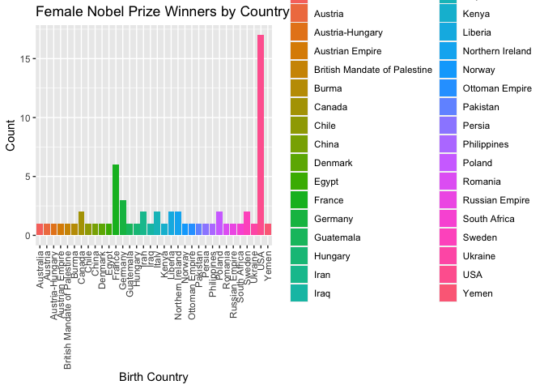
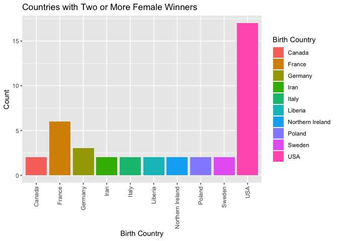
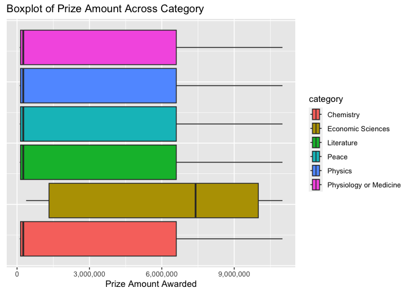
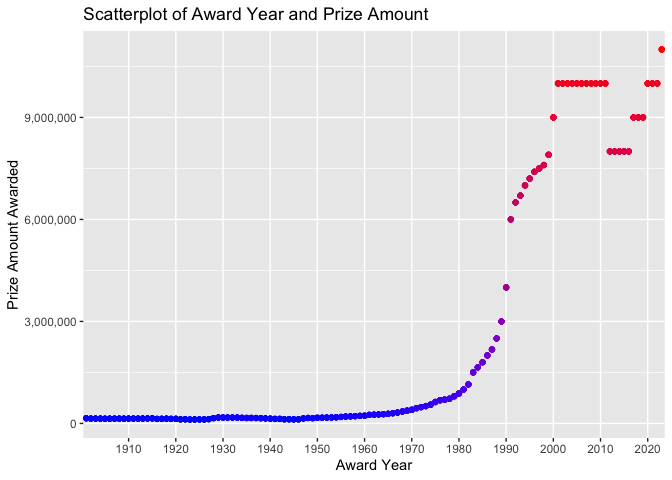

Project 2
================
Tiffany Craft
2023-10-11

- [Nobel Prize API Vignette](#nobel-prize-api-vignette)
- [Required Packages](#required-packages)
- [Functions to Contact API](#functions-to-contact-api)
  - [`getEnglish`](#getenglish)
  - [`prizes`](#prizes)
  - [`laureates`](#laureates)
- [Exploratory Data Analysis (EDA)](#exploratory-data-analysis-eda)
- [Wrap-Up](#wrap-up)

# Nobel Prize API Vignette

This document is a vignette to show how to read and summarizes data from
an API. I will be interacting with the [Nobel Prize
API](https://www.nobelprize.org/about/developer-zone-2/) and writing
functions to contact the API and then do a basic exploratory data
anaylsis with the data I pull.

# Required Packages

The following packages are required for running the functions I craeted
to interact with the API: - `httr`: a user-friendly interface for
interacting with web-based APIs - `jsonlite`: a simple and fast parser
for working with JSON in R - `tidyverse`: helps to transform and better
present data in R - `scales`: customizes axies and legend labels for
plots - `treemapify`: provides ggplot2 geoms for drawing treemaps -
`ggfittext`: provides ggplot2 geoms to fit text into a box

To get started, a user will need to install and load these packages like
so:

``` r
library(httr)
library(jsonlite)
library(tidyverse)
library(scales)
library(treemapify)
library(ggfittext)
```

# Functions to Contact API

The Nobel Prize API contains information about the Nobel Prizes awarded
beginning from 1901 to present day, as well as informatino about all the
Nobel Laureates. It is free to use and does not require an API key.

Below I describe the three functions I wrote to interact with and
organize the data retrieved from the API.

## `getEnglish`

I wrote a helper function called `getEnglish` to make the data returned
from my endpoint functions easier to filter. For several variables
returned by the API, columns included lists of the same data in three
different languages. I needed a way to search only through the English
data for matching user inputs.

``` r
getEnglish <- function(df, column){
  ###
  # This functions unnests a given column with data in multiple languages and then
  # replaces the column with a variable for only the English data.
  ###
  
  # Unnest a single column into separate columns
  df %>% unnest_wider(column, names_repair = "unique_quiet") %>%
    # remove the columns for languages other then English
    subset(select = -c(no, se)) %>%
    # rename the new English column with the original column name
    rename(!!sym(column) := en)
}
```

## `prizes`

I wrote a function called `prizes` to interact with the `Nobel Prizes`
endpoints of the Nobel Prize API. It returns a data frame with key
details about Nobel Prizes awarded in past years, including the year it
was awarded, the category of the award, the prize amount, and the names
of the laureates who received the award. The user can input two
variables to filter the data by the award category and/or the year the
prize was awarded.

``` r
prizes <- function(awardCategory = "all", year = "all"){
  ###
  # This functions returns a data frame with metadata on Nobel Prizes awarded in the past.
  # It can also return those columns for a certain category and/or year.
  ###
  
  # Get the award data from the Nobel Prizes endpoint.
  outputAPI <- fromJSON(
      "https://api.nobelprize.org/2.1/nobelPrizes?limit=1000&sort=asc"
      )
  
  # Select only the Nobel Prizes data from the JSON output and get only the English
  # data for category..
  output <- outputAPI$nobelPrizes %>%
    getEnglish("category") %>%
    getEnglish("categoryFullName")
  
  # If award category does not equal "all", check if it is a category name.
  if (awardCategory != "all"){
    
    # If award category is in the category column, subset output for just that row.
    if (awardCategory %in% output$category){
      output <- output %>%
        filter(category == awardCategory) %>%
        select(awardYear, category, categoryFullName, prizeAmount, laureates)
        
    }
    # Otherwise, throw an informative error.
    else {
      message <- paste("ERROR: Argument for award category was not found in the",
                       "category column. Try award category('all')",
                       "to find the category you're looking for.")
      stop(message)
    }
  }
  # Do nothing but return selected columns if the award category value equals "all".
  else {
    output <- output %>%
      select(awardYear, category, categoryFullName, prizeAmount, laureates)
  }
  
  # If year does not equal "all", check if it is an award year.
  if (year != "all"){
    
    # If year is in the award year column, subset output for just that row.
    if (year %in% output$awardYear){
      output <- output %>%
        filter(awardYear == year) %>%
        select(awardYear, category, categoryFullName, prizeAmount, laureates)
        
    }
    # Otherwise, throw an informative error.
    else {
      message <- paste("ERROR: Argument for year was not found in the",
                       "award year column. Try year('all') to",
                       "find the year you're looking for.")
      stop(message)
    }
  }
  # Do nothing but return selected columns if the year value equals "all".
  else {
    output <- output %>%
      select(awardYear, category, categoryFullName, prizeAmount, laureates)
  }
  
  # Return the output data frame.
  return(output)
}
```

## `laureates`

I wrote a function called `laureates` to interact with the `laureates`
endpoints of the Nobel Prize API. It returns a data frame with key
details about Nobel Prize winning laureates, including their name and ID
number, gender, year they won the award and the category they won in,
and their location at birth and now. The user can input two variables to
filter the data by the laureates’ country of birth or now and the
laureates’ gender.

``` r
laureates <- function(country = "all", laureateGender = "both"){
  ###
  # This functions returns a data frame with metadata on Nobel Prize winning laureates.
  # It can also return those columns for a certain country and/or gender.
  ###
  
  # Get the award data from the laureates endpoint.
  outputAPI <- fromJSON(
      "http://api.nobelprize.org/2.1/laureates?limit=1000"
      )
  
  # Select only the Nobel Prizes data from the JSON output and get only the English
  # data for category, location, and name variables.
  output <- outputAPI$laureates %>%
    unnest_wider(nobelPrizes, names_repair = "unique_quiet") %>%
    getEnglish("category") %>%
    unnest_wider(birth) %>%
    unnest_wider(place) %>%
    getEnglish("city") %>%
      rename("birthCity" = "city") %>%
    getEnglish("country") %>%
      rename("birthCountry" = "country") %>%
    getEnglish("cityNow") %>%
    getEnglish("countryNow") %>%
    getEnglish("continent") %>%
    getEnglish("locationString") %>%
    getEnglish("fullName") %>%
    mutate(awardYear = sapply(awardYear, toString)) %>%
    mutate(category = sapply(category, toString))

  # If country does not equal "all", check if it is a birth country or country now.
  if (country != "all"){
    
    # If country is in the birth country column, subset output for just that row.
    if (country %in% output$birthCountry){
      output <- output %>%
        filter(birthCountry == country) %>%
        select(id, fullName, gender, awardYear, category, birthCity, birthCountry,
               cityNow, countryNow, continent,locationString)
    }
    # If country is in the country now column, subset output for just that row.
    else if (country %in% output$countryNow){
      output <- output %>%
        filter(countryNow == country) %>%
        select(id, fullName, gender, awardYear, category, birthCity, birthCountry,
               cityNow, countryNow, continent,locationString)
    }
    # Otherwise, throw an informative error.
    else {
      message <- paste("ERROR: Argument for country was not found in either",
                       "the birth country or country now columns. Try country('all') to",
                       "find the country you're looking for.")
      stop(message)
    }
  }
  # Do nothing but return selected columns if the country value equals "all".
  else {
      output <- output %>%
        select(id, fullName, gender, awardYear, category, birthCity, birthCountry,
               cityNow, countryNow, continent,locationString)
  }
  
  # If laureate gender does not equal "both", check if it is a gender.
  if (laureateGender != "both"){
    
    # If laureate gender is in the gender column, subset output for just that row.
    if (laureateGender %in% output$gender){
      output <- output %>%
        filter(gender == laureateGender) %>%
        select(id, fullName, gender, awardYear, category, birthCity, birthCountry,
               cityNow, countryNow, continent,locationString)
    }
    # Otherwise, throw an informative error.
    else {
      message <- paste("ERROR: Argument for laureate's gender was not found in the",
                       "gender column. Try genders('both') to",
                       "find the gender you're looking for.")
      stop(message)
    }
  }
  # Do nothing but return selected columns if the laureate gender value equals "both".
  else {
      output <- output %>%
        select(id, fullName, gender, awardYear, category, birthCity, birthCountry,
               cityNow, countryNow, continent,locationString)
  }
  
  # Return the output data frame.
  return(output)
}
```

# Exploratory Data Analysis (EDA)

To begin my data analysis, I wanted to investigate the following
question: How does the number of Nobel Prize winners differ between male
and female laureates? For example, are there perhaps noticeable
differences between categories? Could there be a relationship between
the gender of laureates and the countries they are from?

I started by pulling the data on all the winning laureates by calling
`laureates()` and then created a one-way contingency table to compare
the total winners based on gender.

``` r
# Get data on all Nobel Prize laureates
winners <- laureates()

# Create a one-way contingency table of gender
table(winners$gender)
```

    ## 
    ## female   male 
    ##     64    901

As I expected, there have been significantly more male Nobel Prize
winners than female winners. To continue my investigation, I decided to
create a new, two-way contingency table using the same data to see
whether there might be a relationship between Nobel Prize winners’
gender and their country of birth based on the assumption that women
might receive more opportunities that could lead to their winning a
Nobel Prize if they grow up in certain countries.

``` r
# Create a two-way contigency table of gender vs. country
table(winners$gender, winners$birthCountry)
```

    ##         
    ##          Argentina Australia
    ##   female         0         1
    ##   male           4         9
    ##         
    ##          Austria
    ##   female       1
    ##   male        15
    ##         
    ##          Austria-Hungary
    ##   female               1
    ##   male                12
    ##         
    ##          Austrian Empire
    ##   female               1
    ##   male                 3
    ##         
    ##          Bavaria
    ##   female       0
    ##   male         1
    ##         
    ##          Belgian Congo
    ##   female             0
    ##   male               1
    ##         
    ##          Belgium Bosnia
    ##   female       0      0
    ##   male         9      1
    ##         
    ##          Brazil British India
    ##   female      0             0
    ##   male        1             2
    ##         
    ##          British Mandate of Palestine
    ##   female                            1
    ##   male                              4
    ##         
    ##          British Protectorate of Palestine
    ##   female                                 0
    ##   male                                   1
    ##         
    ##          British West Indies
    ##   female                   0
    ##   male                     1
    ##         
    ##          Bulgaria Burma
    ##   female        0     1
    ##   male          1     0
    ##         
    ##          Canada Chile China
    ##   female      2     1     1
    ##   male       19     1    10
    ##         
    ##          Colombia Costa Rica
    ##   female        0          0
    ##   male          2          1
    ##         
    ##          Crete Cyprus
    ##   female     0      0
    ##   male       1      1
    ##         
    ##          Czechoslovakia
    ##   female              0
    ##   male                1
    ##         
    ##          Denmark
    ##   female       1
    ##   male        11
    ##         
    ##          East Friesland
    ##   female              0
    ##   male                1
    ##         
    ##          East Timor Egypt
    ##   female          0     1
    ##   male            2     5
    ##         
    ##          Ethiopia
    ##   female        0
    ##   male          1
    ##         
    ##          Faroe Islands (Denmark)
    ##   female                       0
    ##   male                         1
    ##         
    ##          Finland France
    ##   female       0      6
    ##   male         2     52
    ##         
    ##          Free City of Danzig
    ##   female                   0
    ##   male                     1
    ##         
    ##          French Algeria
    ##   female              0
    ##   male                2
    ##         
    ##          French protectorate of Tunisia
    ##   female                              0
    ##   male                                1
    ##         
    ##          German-occupied Poland
    ##   female                      0
    ##   male                        1
    ##         
    ##          Germany Gold Coast
    ##   female       3          0
    ##   male        77          1
    ##         
    ##          Guadeloupe Island
    ##   female                 0
    ##   male                   1
    ##         
    ##          Guatemala
    ##   female         1
    ##   male           1
    ##         
    ##          Hesse-Kassel Hungary
    ##   female            0       1
    ##   male              1       8
    ##         
    ##          Iceland India Iran
    ##   female       0     0    2
    ##   male         1    10    0
    ##         
    ##          Iraq Ireland Italy
    ##   female    1       0     2
    ##   male      0       5    16
    ##         
    ##          Japan
    ##   female     0
    ##   male      28
    ##         
    ##          Java, Dutch East Indies
    ##   female                       0
    ##   male                         1
    ##         
    ##          Kenya Korea Lebanon
    ##   female     1     0       0
    ##   male       0     2       1
    ##         
    ##          Liberia Lithuania
    ##   female       2         0
    ##   male         0         1
    ##         
    ##          Luxembourg
    ##   female          0
    ##   male            2
    ##         
    ##          Madagascar
    ##   female          0
    ##   male            1
    ##         
    ##          Mecklenburg Mexico
    ##   female           0      0
    ##   male             1      3
    ##         
    ##          Morocco New Zealand
    ##   female       0           0
    ##   male         1           3
    ##         
    ##          Nigeria
    ##   female       0
    ##   male         1
    ##         
    ##          Northern Ireland
    ##   female                2
    ##   male                  3
    ##         
    ##          Norway
    ##   female      1
    ##   male       12
    ##         
    ##          Ottoman Empire
    ##   female              1
    ##   male                1
    ##         
    ##          Pakistan Persia Peru
    ##   female        1      1    0
    ##   male          0      0    1
    ##         
    ##          Philippines Poland
    ##   female           1      2
    ##   male             0      7
    ##         
    ##          Portugal Prussia
    ##   female        0       0
    ##   male          2      13
    ##         
    ##          Romania Russia
    ##   female       1      0
    ##   male         3     18
    ##         
    ##          Russian Empire
    ##   female              1
    ##   male               15
    ##         
    ##          Saint Lucia
    ##   female           0
    ##   male             1
    ##         
    ##          Schleswig Scotland
    ##   female         0        0
    ##   male           2       11
    ##         
    ##          South Africa
    ##   female            1
    ##   male              8
    ##         
    ##          Southern Rhodesia
    ##   female                 0
    ##   male                   1
    ##         
    ##          Spain Sweden
    ##   female     0      2
    ##   male       7     28
    ##         
    ##          Switzerland Taiwan
    ##   female           0      0
    ##   male            19      1
    ##         
    ##          the Netherlands
    ##   female               0
    ##   male                19
    ##         
    ##          Tibet
    ##   female     0
    ##   male       1
    ##         
    ##          Trinidad and Tobago
    ##   female                   0
    ##   male                     1
    ##         
    ##          Turkey Tuscany
    ##   female      0       0
    ##   male        2       1
    ##         
    ##          Ukraine
    ##   female       1
    ##   male         0
    ##         
    ##          United Kingdom USA
    ##   female              0  17
    ##   male               89 272
    ##         
    ##          USSR Venezuela
    ##   female    0         0
    ##   male      7         1
    ##         
    ##          Vietnam West Germany
    ##   female       0            0
    ##   male         1            5
    ##         
    ##          Württemberg Yemen
    ##   female           0     1
    ##   male             1     0

The table shows some interesting information, including which countries
have had the most past Nobel Prize winners. I am not too surprised to
see that the United States has not only the most total winners but also
the most female winners. Some interesting observations are that many
countries that have a lot of total winners, such as Japan and the United
Kingdom, actually have no female winners. Whereas, others countries,
such as Iran and Iraq, have only had female Nobel Prize winners.

Since the contingency table comparing gender and birth country is rather
large, I decided to narrow in on only the countries that have female
winners. I pulled some new data on all the winning female laureates by
calling `laureates(laureateGender = "female")`. I then created a bar
graph to plot the number of female Nobel Prize winners based on country.

``` r
# Get data on all female laureates
femaleWinners <- laureates(laureateGender = "female")

# Group female laureates by country of birth and get a total count per country
femaleByCountry <- femaleWinners %>%
  group_by(birthCountry) %>%
  summarise(count = n())

# Create a bar graph of country vs. count
plot1 <- ggplot(femaleByCountry, aes(x = birthCountry, y =count)) + 
  # Add a bar graph layer and fill color by country
  geom_bar(aes(fill = birthCountry), stat = "identity") +
  # Add axis labels and title
  labs(x = "Birth Country", y = "Count", title ="Female Nobel Prize Winners by Country") +
  # Add legend for countries
  scale_fill_discrete(name = "Birth Country") +
  # Adjust the x-axis labels to better fit the plot
  theme(axis.text.x = element_text(angle = 90, vjust = 0.5, hjust=1))

# Plot the resulting bar graph
plot1
```

<!-- -->

This looks better, but it is a bit difficult to read because of the
number of countries included. I decided to try plotting the same data in
a different format using the treemaps package for ggplot in hopes that
it would provide a clearer visual representation of the number of female
Nobel Prize laureates per country.

``` r
# Create a treemap of country vs. count
plot2 <- ggplot(femaleByCountry, aes(area = count, fill = count, label = birthCountry)) +
  # Add a treemap layer
  geom_treemap() +
  # Adjust the labels in each tile to better fit the plot
  geom_treemap_text(fontface = "italic", colour = "white", place = "centre", grow = TRUE)

# Plot the resulting treemap
plot2
```

<!-- -->

The treemap is nice because it helps to really highlight which countries
have the most female Nobel Prize Winners based on the size of their
individual tiles, clearly showing that the United States has the most
female laureates followed by France.

Still, since we could already see from the earlier bar graph that there
are clearly a lot of countries that have just one female Nobel Prize
winner, I thought we could further narrow down the countries with more
female laureates by sorting the data for only those that have two or
more winners.

``` r
# Filter the data for only countries with at least two or more past female laureates
twoPlusFemales <- femaleByCountry %>%
  filter(count > 1)

# Create a bar graph of country vs. count
plot3 <- ggplot(twoPlusFemales, aes(x = birthCountry, y =count)) + 
  # Add a bar graph layer and fill color by country
  geom_bar(aes(fill = birthCountry), stat = "identity") +
  # Add axis labels and title
  labs(x = "Birth Country", y = "Count", title ="Countries with Two or More Female Winners") +
  # Add legend for countries
  scale_fill_discrete(name = "Birth Country") +
  # Adjust the x-axis labels to better fit the plot
  theme(axis.text.x = element_text(angle = 90, vjust = 0.5, hjust=1))

# Plot the resulting bar graph
plot3
```

<!-- -->

Based on this new graph, we can see that the majority of countries with
two or more female Nobel Prize winners are located in either Europe or
North America, with the exception of Iran and Liberia.

This brings me to back to my earlier observation that Iran and Iraq had
only female laureates but no male laureates. To further investigate this
information, I called `laureates("Iran)` and `laureates("Iraq")` to pull
data for these countries only.

``` r
laureates("Iran")
```

    ## # A tibble: 2 × 11
    ##   id    fullName        gender
    ##   <chr> <chr>           <chr> 
    ## 1 1033  Narges Mohamma… female
    ## 2 773   Shirin Ebadi    female
    ## # ℹ 8 more variables:
    ## #   awardYear <chr>,
    ## #   category <chr>,
    ## #   birthCity <chr>,
    ## #   birthCountry <chr>,
    ## #   cityNow <chr>,
    ## #   countryNow <chr>, …

``` r
laureates("Iraq")
```

    ## # A tibble: 1 × 11
    ##   id    fullName        gender
    ##   <chr> <chr>           <chr> 
    ## 1 967   Nadia Murad Ba… female
    ## # ℹ 8 more variables:
    ## #   awardYear <chr>,
    ## #   category <chr>,
    ## #   birthCity <chr>,
    ## #   birthCountry <chr>,
    ## #   cityNow <chr>,
    ## #   countryNow <chr>, …

The data shows that all three female laureates from these countries were
winners of The Nobel Peace Prize. This led me to wonder whether female
Nobel Prize winners have been awarded more prizes in certain categories
over others.

To further investigate this, I started by creating a one-way contingency
table comparing how many awards female laureates have received in each
of the six categories using the previous data I pulled from calling
`laureates(laureateGender = "female")`.

``` r
# Create a one-way contingency table of category for female laureates
table(femaleWinners$category)
```

    ## 
    ##              Chemistry 
    ##                      7 
    ##      Economic Sciences 
    ##                      3 
    ##             Literature 
    ##                     17 
    ##                  Peace 
    ##                     19 
    ##                Physics 
    ##                      4 
    ##     Physics, Chemistry 
    ##                      1 
    ## Physiology or Medicine 
    ##                     13

The table shows that female Nobel Prize winners have been awarded the
most prizes in the categories of Peace, Physiology or Medicine, and
Literature, but have received fewer prizes in the scientific categories.

This observation then led me to wonder whether the monetary prize amount
awarded to Nobel Prize winners differs among categories, which could
lead to female and male laureates receiving different average prize
amounts.To further investigate this, I first called `prizes()` to pull
data on all the Nobel Prizes given out over the years.

I then found numerical summary data for the prize amount as grouped by
the different Nobel Prize categories.

``` r
# Get data for all Nobel Prizes awarded
nobelPrizes <- prizes()

# Find measures of center and spread for prize amount grouped by variable: category
nobelPrizes %>% group_by(category) %>%
  summarise(avgAmt = mean(prizeAmount), medAmt = median(prizeAmount),
            minAmt = min(prizeAmount), maxAmt = max(prizeAmount),
            varAmt = var(prizeAmount))
```

    ## # A tibble: 6 × 6
    ##   category       avgAmt medAmt
    ##   <chr>           <dbl>  <int>
    ## 1 Chemistry      2.68e6 2.57e5
    ## 2 Economic Scie… 5.80e6 7.4 e6
    ## 3 Literature     2.68e6 2.57e5
    ## 4 Peace          2.68e6 2.57e5
    ## 5 Physics        2.68e6 2.57e5
    ## 6 Physiology or… 2.68e6 2.57e5
    ## # ℹ 3 more variables:
    ## #   minAmt <int>,
    ## #   maxAmt <int>,
    ## #   varAmt <dbl>

Using this same data, I also created some boxplots for a better visual
representation of the numerical summaries.

``` r
# Create a box plot for numeric variable prize amount across categorical variable category
plot4 <- ggplot(nobelPrizes, aes(x = prizeAmount, fill = category)) +
  # Add box plot layer
  geom_boxplot() +
  # Add axis label and title
  labs(x = "Prize Amount Awarded", title = "Boxplot of Prize Amount Across Category") +
  # Add theme to remove y-axis labels and tick marks
  theme(
    axis.text.y = element_blank(),
    axis.ticks.y = element_blank()
  ) +
  # Change x-axis labels from scientific notation
  scale_x_continuous(labels = comma)

# Plot resulting box plots
plot4
```

<!-- -->

Based on the table and box plots, we can see that the prize amount
generally does not vary by category, except for the category of Economic
Sciences. Some additional internet research revealed that this is
because the Nobel Prize in the category of Economic Sciences was not
established until 1968. The box plot for Economic Sciences does reveal
another interesting observation, however. The median and interquartile
range for this category is higher than the others, which made me wonder
if the Nobel Prize prize award amount has increased steadily through the
years since it first began in 1901. Thus, I decided to investigate this
by finding the numerical summary data for the prize amount as grouped by
award year.

``` r
# Find measures of center and spread for prize amount grouped by variable: awardYear
nobelPrizes %>% group_by(awardYear) %>%
  summarise(avgAmt = mean(prizeAmount), medAmt = median(prizeAmount),
            minAmt = min(prizeAmount), maxAmt = max(prizeAmount), varAmt = var(prizeAmount))
```

    ## # A tibble: 123 × 6
    ##    awardYear avgAmt medAmt
    ##    <chr>      <dbl>  <dbl>
    ##  1 1901      150782 150782
    ##  2 1902      141847 141847
    ##  3 1903      141358 141358
    ##  4 1904      140859 140859
    ##  5 1905      138089 138089
    ##  6 1906      138536 138536
    ##  7 1907      138796 138796
    ##  8 1908      139800 139800
    ##  9 1909      139800 139800
    ## 10 1910      140703 140703
    ## # ℹ 113 more rows
    ## # ℹ 3 more variables:
    ## #   minAmt <int>,
    ## #   maxAmt <int>,
    ## #   varAmt <dbl>

I also used this same data to create a scatter plot looking at changes
over the years chronologically.

``` r
# Create a scatter plot for numeric variable prize amount across categorical variable award year
plot5 <- ggplot(nobelPrizes, aes(x = awardYear, y = prizeAmount, color = prizeAmount)) +
  # Add scatter plot later
  geom_point() +
  # Add axis labels and title
  labs(x = "Award Year", y = "Prize Amount Awarded", 
       title = "Scatterplot of Award Year and Prize Amount") +
  # Adjust x-axis for labels increasing in increements of 10
  scale_x_discrete(breaks = seq(1900, 2030, by = 10)) +
  # Change y-axis labels from scientific notation
  scale_y_continuous(labels = comma) +
  # Remove legend
  theme(legend.position="none") +
  # Add color gradient from blue to red based on amount
  scale_color_gradient(low="blue", high="red")

# Plot resulting scatter plot
plot5
```

<!-- -->

The scatter plot shows that while the prize amount awarded has increased
since the Nobel Prize awards were established, this increase has not
been at a steady and continuous rate. In fact, there have been years
where the award amount actually decreased from the year before. This is
interesting to note and makes me wonder how the prize amount is
calculated, though the data I have does not allow me to explore this any
further at this time.

# Wrap-Up

To summarize what I did in this vignette, I wrote functions to interact
with the Nobel Prize API’s endpoints, retrieved some data, and explored
it using tables, numerical summaries, and data visualization through a
variety of different plots. Some of my findings were not too surprising,
such as there being a significantly greater number of male versus female
laureates, and the United States having both the greatest total number
of past Nobel Prize winners and greatest number of female laureates. I
also discovered some interesting new information, such as how female
Nobel Prize winners have generally won a lot more in certain categories
but are still far behind in the scientific categories.
